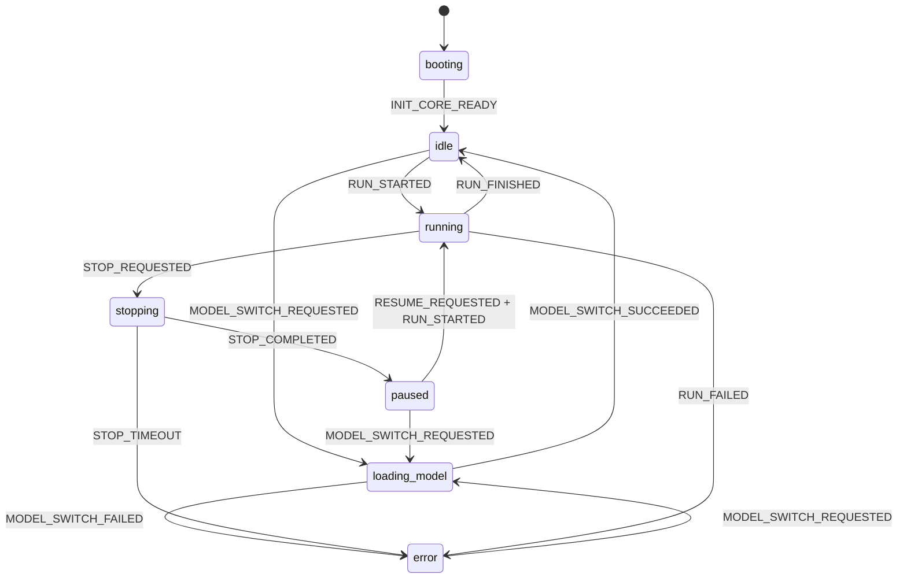
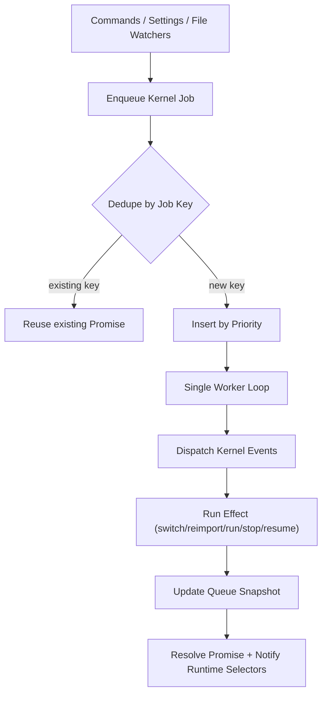

# Open Smart Connections

An Obsidian plugin that uses AI embeddings to surface semantically related notes. Works offline with local models, or connect to any major embedding provider.

> Community-maintained fork of [Smart Connections](https://github.com/brianpetro/obsidian-smart-connections) by Brian Petro, rebuilt for stability and extensibility.

## Quick Start

### Install from Release

1. Download `main.js`, `manifest.json`, and `styles.css` from the [latest release](https://github.com/GoBeromsu/Open-smart-connections/releases/latest)
2. Create `.obsidian/plugins/open-smart-connections/` in your vault
3. Copy the three files into that folder
4. Enable **Open Smart Connections** in Settings > Community Plugins

### Build from Source

```bash
git clone https://github.com/GoBeromsu/Open-smart-connections.git
cd Open-smart-connections
npm install
npm run build
```

Copy `dist/` contents to your vault's `.obsidian/plugins/open-smart-connections/` directory.

### Development

```bash
# Set your test vault in .env
echo 'DESTINATION_VAULTS=../../Obsidian/YourVault' > .env

# Watch mode — auto-rebuilds and hot-reloads on save
npm run build:watch
```

## Features

- **Zero-setup local embeddings** — runs TaylorAI/bge-micro-v2 in-browser via transformers.js, no API key needed
- **Expanded local multilingual options** — includes `Xenova/bge-m3` and multilingual E5 variants
- **7 embedding providers** — Transformers (local), OpenAI, Ollama, Gemini, LM Studio, Upstage, OpenRouter
- **Dynamic model selection** — settings UI auto-discovers models from API providers
- **Model fingerprint re-embed safety** — forces re-embedding when adapter/model/host changes
- **Privacy-first** — your notes never leave your device with local models
- **Mobile support** — works on iOS and Android
- **Connections View** — see related notes as you navigate your vault
- **Semantic search** — find notes by meaning, not just keywords

## Tech Stack

| Category | Technology |
|----------|------------|
| Platform | Obsidian Plugin API |
| Language | TypeScript, JavaScript |
| Bundler | esbuild |
| Embeddings | transformers.js (local), OpenAI, Ollama, Gemini, LM Studio, Upstage, OpenRouter |
| Testing | AVA |

## Project Structure

```
obsidian-smart-connections/
├── src/                        # Plugin source
│   ├── index.js                # Plugin entry point
│   ├── settings_tab.ts         # Settings UI with provider/model selection
│   ├── views/                  # Obsidian ItemView wrappers
│   └── utils/                  # Helper functions
├── lib/                        # Unified library (no separate package.json)
│   ├── core/                   # Utilities, adapters, collections, fs, http
│   ├── models/                 # AI model integrations
│   │   ├── embed/              # Embedding adapters (7 providers)
│   │   └── chat/               # Chat model adapters
│   ├── entities/               # Content entities (sources, blocks)
│   ├── environment/            # SmartEnv runtime
│   └── obsidian/               # Obsidian-specific integrations
├── dist/                       # Build output (gitignored)
├── esbuild.js                  # Build configuration
├── tsconfig.json               # TypeScript config
└── manifest.json               # Obsidian plugin manifest
```

## Embedding Providers

| Provider | Type | Models | API Key |
|----------|------|--------|---------|
| Transformers | Local (in-browser) | bge-micro-v2, bge-m3, multilingual-e5-large/small, paraphrase-multilingual-MiniLM-L12-v2, bge-small, nomic-embed, jina-v2 | No |
| OpenAI | API | text-embedding-3-small/large, ada-002, + dim variants | Yes |
| Ollama | Local (server) | Any pulled embedding model (+ recommended quick picks in settings) | No |
| Gemini | API | gemini-embedding-001 | Yes |
| LM Studio | Local (server) | Any loaded embedding model | No |
| Upstage | API | embedding-query, embedding-passage | Yes |
| OpenRouter | API | Auto-discovered embedding models | Yes |

## Usage

1. Open Settings > Open Smart Connections
2. Choose an **embedding provider** (default: Transformers local)
3. Select a **model** from the dropdown
4. For API providers, enter your API key
5. Open the **Connections** view from the ribbon or command palette
6. Navigate your vault — related notes appear automatically

## Embedding Kernel State Machine



## Embedding Job Queue Lifecycle



## Refactoring Stages Note

- The `Level 1/2/3` labels used in this repository are internal rollout names, not official Martin Fowler stage names.
- They follow Fowler's core refactoring principles: preserve behavior, change in small steps, and keep tests as the safety net.
- For study: Martin Fowler's [Refactoring](https://martinfowler.com/books/refactoring.html) and the refactoring catalog at [martinfowler.com](https://refactoring.com/catalog/).

## Recommended Local Models

- `Xenova/bge-m3` — high-quality multilingual local transformers option
- `Xenova/multilingual-e5-large` — higher-quality multilingual retrieval option
- `Xenova/multilingual-e5-small` — lighter multilingual option for lower resource usage
- `Xenova/paraphrase-multilingual-MiniLM-L12-v2` — compact multilingual baseline

## Ollama Quick Picks

- `bge-m3`
- `nomic-embed-text`
- `snowflake-arctic-embed2`
- `mxbai-embed-large`

## Contributing

1. Fork this repository
2. Create a feature branch (`git checkout -b feature/your-feature`)
3. Follow [Conventional Commits](https://www.conventionalcommits.org/) (`feat:`, `fix:`, `refactor:`, etc.)
4. Run `npm run build` to verify
5. Submit a pull request

## License

**GNU General Public License v3.0** (GPL-3.0)

### Attribution

This is a modified version of [Smart Connections](https://github.com/brianpetro/obsidian-smart-connections) originally created by [Brian Petro](https://github.com/brianpetro).

- Original Copyright (C) Brian Petro
- Fork maintained by the community

Per GPL-3.0 Section 5, this modified version is clearly marked as different from the original.

## Links

- [Releases](https://github.com/GoBeromsu/Open-smart-connections/releases)
- [Original Repository](https://github.com/brianpetro/obsidian-smart-connections)
- [Original Documentation](https://smartconnections.app/)
- [Obsidian](https://obsidian.md/)

---

*This fork is not affiliated with or endorsed by the original Smart Connections project.*
